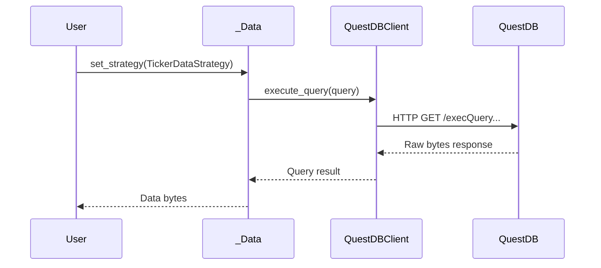

```mermaid
sequenceDiagram
    participant User
    participant _Data
    participant QuestDBClient
    participant QuestDB

    User->>_Data: set_strategy(TickerDataStrategy)
    _Data->>QuestDBClient: execute_query(query)
    QuestDBClient->>QuestDB: HTTP GET /execQuery...
    QuestDB-->>QuestDBClient: Raw bytes response
    QuestDBClient-->>_Data: Query result
    _Data-->>User: Data bytes
```